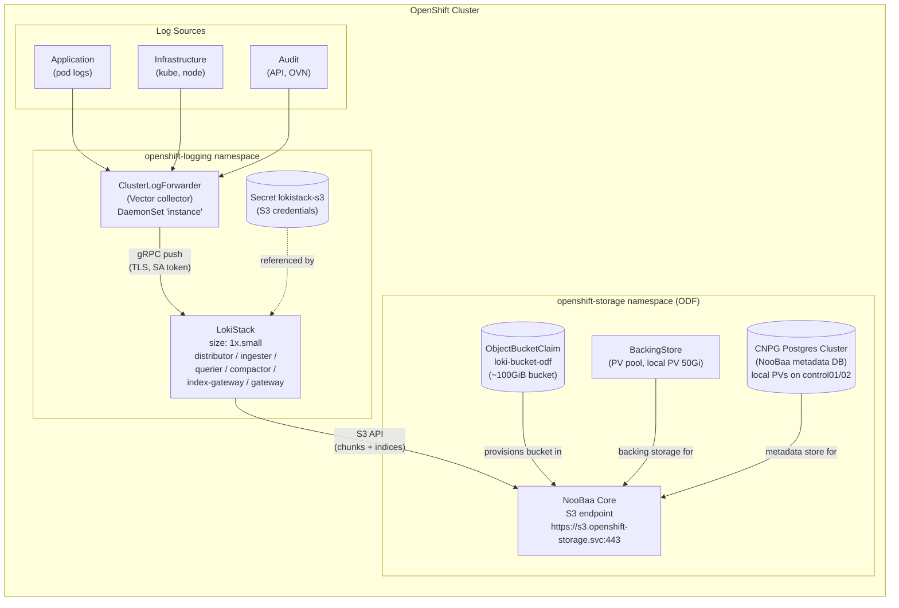

# OpenShift Logging with Loki + ODF (NooBaa)

This repo documents the step-by-step process for installing and configuring Red Hat OpenShift Logging 6.6 with a LokiStack that stores log data in OpenShift Data Foundation (ODF) NooBaa object storage, using a dedicated ~100GiB bucket.

## Architecture



## Prerequisites

- OpenShift 4.22+ cluster with admin access (`oc whoami` → `system:admin`)
- Red Hat OpenShift Logging Operator 6.6.1 installed
- Loki Operator 6.6.1 installed
- Cluster Observability Operator 1.5.2 installed
- OpenShift Data Foundation (ODF) / NooBaa 4.22.5 installed
- A StorageClass for block storage (used by LokiStack WAL/index PVCs and NooBaa DB)
- Sufficient node disk space for local PVs (if using local storage for NooBaa)

## Step-by-Step Setup

### Step 1: Verify Operators Are Installed

```bash
oc get csv -A | grep -iE 'loki|logging|observability'
```

Expected output:
```
cluster-logging.v6.6.1    Red Hat OpenShift Logging   6.6.1   Succeeded
loki-operator.v6.6.1      Loki Operator               6.6.1   Succeeded
cluster-observability-operator.v1.5.2  Cluster Observability Operator  1.5.2  Succeeded
```

If any are missing, install them via the Web Console (Operators → OperatorHub) or CLI:

```bash
# Loki Operator
oc apply -f - <<'EOF'
apiVersion: operators.coreos.com/v1alpha1
kind: Subscription
metadata:
  name: loki-operator
  namespace: openshift-operators-redhat
spec:
  channel: stable-6.6
  installPlanApproval: Automatic
  name: loki-operator
  source: redhat-operators
  sourceNamespace: openshift-marketplace
EOF

# Red Hat OpenShift Logging Operator
oc apply -f - <<'EOF'
apiVersion: operators.coreos.com/v1alpha1
kind: Subscription
metadata:
  name: cluster-logging
  namespace: openshift-logging
spec:
  channel: stable-6.6
  installPlanApproval: Automatic
  name: cluster-logging
  source: redhat-operators
  sourceNamespace: openshift-marketplace
EOF
```

### Step 2: Fix NooBaa Database Storage (Critical)

**Problem:** The default `nfs-csi` StorageClass propagates the setgid bit to subdirectories. PostgreSQL (used by NooBaa's CNPG database cluster) refuses to initialize a data directory with group permission bits set, causing the `noobaa-db-pg-cluster-1-initdb` job to fail in a crash loop with:

```
FATAL:  data directory "/var/lib/postgresql/data/pgdata" has invalid permissions
DETAIL:  Permissions should be u=rwx (0700) or u=rwx,g=rx (0750).
```

**Solution:** Use local PVs for the NooBaa database instead of NFS.

#### 2a. Create a Local StorageClass

```bash
cat <<'EOF' | oc apply -f -
apiVersion: storage.k8s.io/v1
kind: StorageClass
metadata:
  name: local-fast
provisioner: kubernetes.io/no-provisioner
volumeBindingMode: WaitForFirstConsumer
allowVolumeExpansion: true
EOF
```

#### 2b. Create Local PVs for NooBaa DB (primary + replica)

Create directories on the target nodes first:

```bash
# On control01 (primary)
oc debug --as-root -q node/control01.syangsao.net -- \
  chroot /host sh -c 'mkdir -p /var/lib/noobaa-db'

# On control02 (replica)
oc debug --as-root -q node/control02.syangsao.net -- \
  chroot /host sh -c 'mkdir -p /var/lib/noobaa-db'
```

Create the PVs:

```bash
cat <<'EOF' | oc apply -f -
apiVersion: v1
kind: PersistentVolume
metadata:
  name: noobaa-db-local-pv
spec:
  capacity:
    storage: 50Gi
  accessModes:
    - ReadWriteOncePod
  persistentVolumeReclaimPolicy: Retain
  storageClassName: local-fast
  local:
    path: /var/lib/noobaa-db
  nodeAffinity:
    required:
      nodeSelectorTerms:
      - matchExpressions:
        - key: kubernetes.io/hostname
          operator: In
          values:
          - control01.syangsao.net
---
apiVersion: v1
kind: PersistentVolume
metadata:
  name: noobaa-db-local-pv-2
spec:
  capacity:
    storage: 50Gi
  accessModes:
    - ReadWriteOncePod
  persistentVolumeReclaimPolicy: Retain
  storageClassName: local-fast
  local:
    path: /var/lib/noobaa-db
  nodeAffinity:
    required:
      nodeSelectorTerms:
      - matchExpressions:
        - key: kubernetes.io/hostname
          operator: In
          values:
          - control02.syangsao.net
EOF
```

#### 2c. Patch the StorageCluster to Use Local Storage for NooBaa DB

The `StorageCluster` CR (owned by OCS operator) controls the NooBaa DB storage class via `spec.multiCloudGateway.dbStorageClassName`. This is what actually gets applied — patching the NooBaa CR directly gets reverted.

```bash
oc patch storagecluster ocs-storagecluster -n openshift-storage \
  --type=merge \
  -p '{"spec":{"multiCloudGateway":{"dbStorageClassName":"local-fast"}}}'
```

#### 2d. Delete and Let NooBaa Recreate the CNPG Cluster

If the CNPG cluster is already in a failed/unrecoverable state:

```bash
# Set cleanup policy to allow NooBaa deletion
oc patch noobaa noobaa -n openshift-storage --type=merge \
  -p '{"spec":{"cleanupPolicy":{"allowNoobaaDeletion":true,"confirmation":"I am aware that this action will delete the NooBaa system and all associated resources"}}}'

# Delete the CNPG cluster (NooBaa operator will recreate it)
oc delete clusters.postgresql.cnpg.noobaa.io noobaa-db-pg-cluster -n openshift-storage --wait=false
```

Wait for the new CNPG cluster to use `local-fast` and bind to the local PVs:

```bash
oc get pvc -n openshift-storage | grep noobaa
# Expected: both PVCs Bound to noobaa-db-local-pv and noobaa-db-local-pv-2
```

### Step 3: Wait for NooBaa Core to Become Ready

```bash
oc get noobaa -n openshift-storage -w
# Wait until PHASE = Ready and S3-ENDPOINTS is populated
```

Expected:
```
NAME     S3-ENDPOINTS                      PHASE
noobaa   ["https://192.168.x.x:32686"]    Ready
```

### Step 4: Create Local PV for NooBaa BackingStore (Object Storage)

The BackingStore uses a PV pool for object storage. It also needs a local PV:

```bash
# Create directory on node
oc debug --as-root -q node/control01.syangsao.net -- \
  chroot /host sh -c 'mkdir -p /var/lib/noobaa-backing-store'

cat <<'EOF' | oc apply -f -
apiVersion: v1
kind: PersistentVolume
metadata:
  name: noobaa-backing-store-pv
spec:
  capacity:
    storage: 50Gi
  accessModes:
    - ReadWriteOnce
  persistentVolumeReclaimPolicy: Retain
  storageClassName: local-fast
  local:
    path: /var/lib/noobaa-backing-store
  nodeAffinity:
    required:
      nodeSelectorTerms:
      - matchExpressions:
        - key: kubernetes.io/hostname
          operator: In
          values:
          - control01.syangsao.net
EOF
```

Wait for the BackingStore to become Ready:

```bash
oc get backingstore -n openshift-storage -w
# Wait until PHASE = Ready
```

### Step 5: Create ObjectBucketClaim for Loki

This provisions a dedicated S3 bucket in NooBaa for Loki log storage (~100GiB total capacity from the backing store PV pool).

```bash
cat <<'EOF' | oc apply -f -
apiVersion: objectbucket.io/v1alpha1
kind: ObjectBucketClaim
metadata:
  finalizers:
  - objectbucket.io/finalizer
  labels:
    app: noobaa
    bucket-provisioner: openshift-storage.noobaa.io-obc
    noobaa-domain: openshift-storage.noobaa.io
  name: loki-bucket-odf
  namespace: openshift-logging
spec:
  additionalConfig:
    bucketclass: noobaa-default-bucket-class
  generateBucketName: loki-bucket-odf
  objectBucketName: obc-openshift-lokistack-bucket-odf
  storageClassName: openshift-storage.noobaa.io
EOF
```

Wait for the OBC to become Bound:

```bash
oc get objectbucketclaim -n openshift-logging -w
# Wait until PHASE = Bound
```

### Step 6: Create Loki S3 Secret

Extract bucket credentials from the OBC and create a secret for the LokiStack:

```bash
BUCKET_HOST=$(oc get -n openshift-logging configmap loki-bucket-odf -o jsonpath='{.data.BUCKET_HOST}')
BUCKET_NAME=$(oc get -n openshift-logging configmap loki-bucket-odf -o jsonpath='{.data.BUCKET_NAME}')
BUCKET_PORT=$(oc get -n openshift-logging configmap loki-bucket-odf -o jsonpath='{.data.BUCKET_PORT}')
ACCESS_KEY_ID=$(oc get -n openshift-logging secret loki-bucket-odf -o jsonpath='{.data.AWS_ACCESS_KEY_ID}' | base64 -d)
SECRET_ACCESS_KEY=$(oc get -n openshift-logging secret loki-bucket-odf -o jsonpath='{.data.AWS_SECRET_ACCESS_KEY}' | base64 -d)

oc create -n openshift-logging secret generic lokistack-s3 \
  --from-literal=access_key_id="${ACCESS_KEY_ID}" \
  --from-literal=access_key_secret="${SECRET_ACCESS_KEY}" \
  --from-literal=bucketnames="${BUCKET_NAME}" \
  --from-literal=endpoint="https://${BUCKET_HOST}:${BUCKET_PORT}" \
  --from-literal=forcepathstyle="true"
```

### Step 7: Create the LokiStack CR

Uses `1x.small` size (the `1x.demo` size is too small for production log volumes — the collector OOMs at 2Gi). The LokiStack uses NFS for block storage (WAL/index cache) and NooBaa for object storage (log chunks + indices).

```bash
cat <<'EOF' | oc apply -f -
apiVersion: loki.grafana.com/v1
kind: LokiStack
metadata:
  name: lokistack
  namespace: openshift-logging
spec:
  limits:
    global:
      retention:
        days: 3
  size: 1x.small
  storageClassName: nfs-csi
  storage:
    schemas:
    - effectiveDate: "2026-09-29"
      version: v13
    secret:
      name: lokistack-s3
      type: s3
    tls:
      caName: openshift-service-ca.crt
  tenants:
    mode: openshift-logging
EOF
```

Wait for all LokiStack pods to become Ready:

```bash
oc get pods -n openshift-logging | grep lokistack
# All should be 1/1 Running (gateway is 2/2)
```

### Step 8: Create Collector Service Account and RBAC

```bash
oc create sa logging-collector -n openshift-logging

oc adm policy add-cluster-role-to-user logging-collector-logs-writer \
  -z logging-collector -n openshift-logging
oc adm policy add-cluster-role-to-user collect-application-logs \
  -z logging-collector -n openshift-logging
oc adm policy add-cluster-role-to-user collect-infrastructure-logs \
  -z logging-collector -n openshift-logging
oc adm policy add-cluster-role-to-user collect-audit-logs \
  -z logging-collector -n openshift-logging
```

### Step 9: Create the ClusterLogForwarder

```bash
cat <<'EOF' | oc apply -f -
apiVersion: observability.openshift.io/v1
kind: ClusterLogForwarder
metadata:
  name: instance
  namespace: openshift-logging
spec:
  serviceAccount:
    name: logging-collector
  outputs:
  - name: ocp-lokistack
    type: lokiStack
    lokiStack:
      target:
        name: lokistack
        namespace: openshift-logging
      authentication:
        token:
          from: serviceAccount
    tls:
      ca:
        key: service-ca.crt
        configMapName: openshift-service-ca.crt
  pipelines:
  - name: infra-app-logs
    inputRefs:
    - infrastructure
    - application
    - audit
    outputRefs:
    - ocp-lokistack
EOF
```

### Step 10: Increase Collector Memory (Critical)

The CLF operator sets the collector memory limit to 2Gi based on the LokiStack size profile, which is insufficient for clusters with significant log volume. The collector will OOMKill in a crash loop.

**Solution:** Set the ClusterLogForwarder to `Unmanaged` mode and patch the DaemonSet directly:

```bash
# Switch to Unmanaged so the operator stops overriding resources
oc patch clusterlogforwarder instance -n openshift-logging \
  --type=merge \
  -p '{"spec":{"managementState":"Unmanaged"}}'

# Patch the DaemonSet with higher memory limits
oc patch daemonset instance -n openshift-logging --type=json -p '[
  {"op":"replace","path":"/spec/template/spec/containers/0/resources/limits/memory","value":"8Gi"},
  {"op":"replace","path":"/spec/template/spec/containers/0/resources/requests/memory","value":"1Gi"}
]'
```

Wait for the collector pods to restart with the new limits:

```bash
oc get pods -n openshift-logging | grep instance
# Should be 1/1 Running with 0 restarts
```

### Step 11: Reset Collector State (If Old Logs Cause 500 Errors)

If the collector was previously running and accumulated old log offsets, it may try to replay logs that are outside the LokiStack schema's `effectiveDate` window, causing `500 Internal Server Error` responses from the ingester (`no schema config found for time`).

**Solution:** Delete the collector pods to force a fresh start:

```bash
oc delete pod -n openshift-logging -l app.kubernetes.io/name=cluster-logging-collector --wait=false
# Or by name:
oc delete pod -n openshift-logging instance-<hash> --wait=false
```

The new pods will start reading from the current position, not replaying old logs.

### Step 12: Verify the Full Stack

```bash
# All pods should be Running
oc get pods -n openshift-logging

# ClusterLogForwarder should be Ready
oc get clusterlogforwarder instance -n openshift-logging -o json | \
  python3 -c "import json,sys; d=json.load(sys.stdin); [print(f'{c[\"type\"]}: {c.get(\"message\",\"\")}') for c in d['status'].get('conditions',[])]"

# Check collector logs for successful sends (no 500/429 errors)
oc logs -n openshift-logging $(oc get pods -n openshift-logging -o name | grep instance | head -1 | cut -d/ -f2) --tail=20

# Check Loki ingester for successful stream creation
oc logs -n openshift-logging lokistack-ingester-0 --tail=20
```

## Troubleshooting

### NooBaa DB initdb Fails with "invalid permissions"

**Cause:** NFS StorageClass propagates setgid to subdirectories; PostgreSQL rejects data directories with group bits.

**Fix:** Use local PVs for the NooBaa database (see Step 2). Patch `spec.multiCloudGateway.dbStorageClassName` on the StorageCluster CR — NOT the NooBaa CR directly (it gets reverted by the OCS operator).

### Collector Pods OOMKilled (Exit Code 137)

**Cause:** The CLF operator sets a 2Gi memory limit on the collector, which is insufficient for clusters with high log volume.

**Fix:** Set `managementState: Unmanaged` on the ClusterLogForwarder and patch the DaemonSet to 8Gi (see Step 10).

### Collector Gets 500 Errors from Loki Ingesters

**Cause:** The collector is replaying old log entries with timestamps before the LokiStack schema's `effectiveDate`. The ingester rejects them with "no schema config found for time".

**Fix:** Delete the collector pods to reset their file offsets (see Step 11). New pods start from the current position.

### NooBaa BackingStore Stuck in "Creating"

**Cause:** The backing store PV pool PVC can't bind because there's no matching PV available.

**Fix:** Create a local PV for the backing store (see Step 4). The PVC uses the `pvPoolDefaultStorageClass` from the NooBaa CR, which defaults to the cluster's default StorageClass. If using local storage, ensure a matching PV exists.

### LokiStack Pods Pending

**Cause:** The `storageClassName` in the LokiStack CR doesn't have sufficient capacity or the provisioner isn't running.

**Fix:** Verify the StorageClass exists and has available capacity:
```bash
oc get storageclass
oc get pvc -n openshift-logging | grep lokistack
```

## Sizing Reference

| LokiStack Size | Collector Memory | Use Case |
|---------------|-----------------|----------|
| `1x.demo`     | 2Gi (insufficient) | Not recommended — OOMs on real clusters |
| `1x.pico`     | ~2Gi | Very small dev clusters |
| `1x.extra-small` | ~2Gi | Small clusters, low log volume |
| `1x.small`    | 2Gi (needs override to 8Gi) | Medium clusters |
| `1x.medium`   | Larger | Production clusters |

For this setup, `1x.small` with an 8Gi collector memory override works well for a medium-sized cluster.

## Cleanup / Teardown

```bash
# Delete logging resources
oc delete clusterlogforwarder instance -n openshift-logging
oc delete lokistack lokistack -n openshift-logging
oc delete secret lokistack-s3 -n openshift-logging
oc delete objectbucketclaim loki-bucket-odf -n openshift-logging

# Delete NooBaa (if you want to remove ODF object storage)
oc patch noobaa noobaa -n openshift-storage --type=merge \
  -p '{"spec":{"cleanupPolicy":{"allowNoobaaDeletion":true,"confirmation":"I am aware that this action will delete the NooBaa system and all associated resources"}}}'
oc delete noobaa noobaa -n openshift-storage

# Delete local PVs (optional — data is retained on disk)
oc delete pv noobaa-db-local-pv noobaa-db-local-pv-2 noobaa-backing-store-pv
```

## References

- [Red Hat OpenShift Logging 6.6 Install Guide](https://docs.redhat.com/en/documentation/red_hat_openshift_logging/6.6/html-single/install/index)
- [Fabio Reis: OpenShift Observability - Configuring Logging](https://fabreur.medium.com/openshift-observability-configuring-logging-1b149ecd25c7)
- [LokiStack Sizing Guide (OCP 4.10+)](https://docs.redhat.com/en/documentation/openshift_container_platform/latest/html/logging/cluster-logging-loki)
